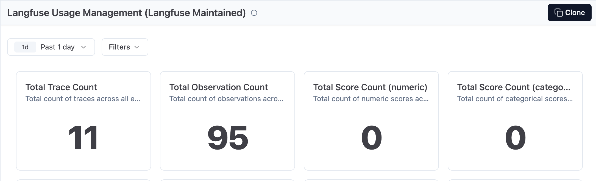
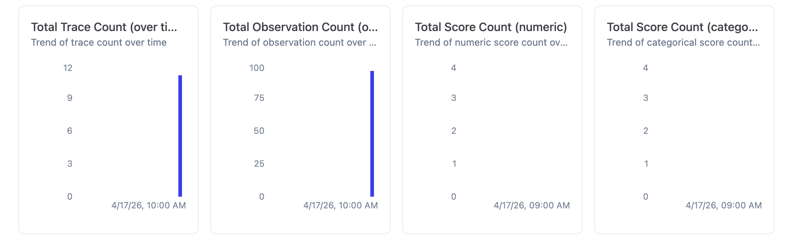
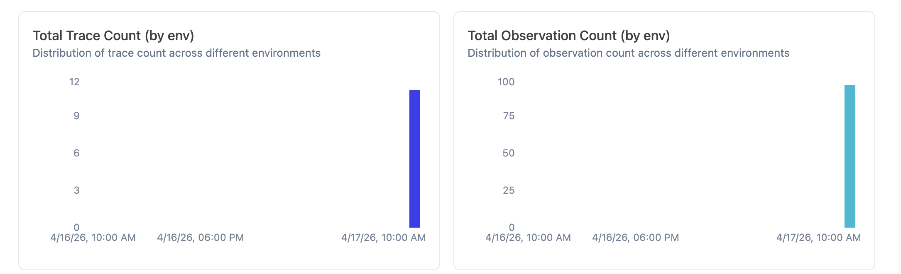
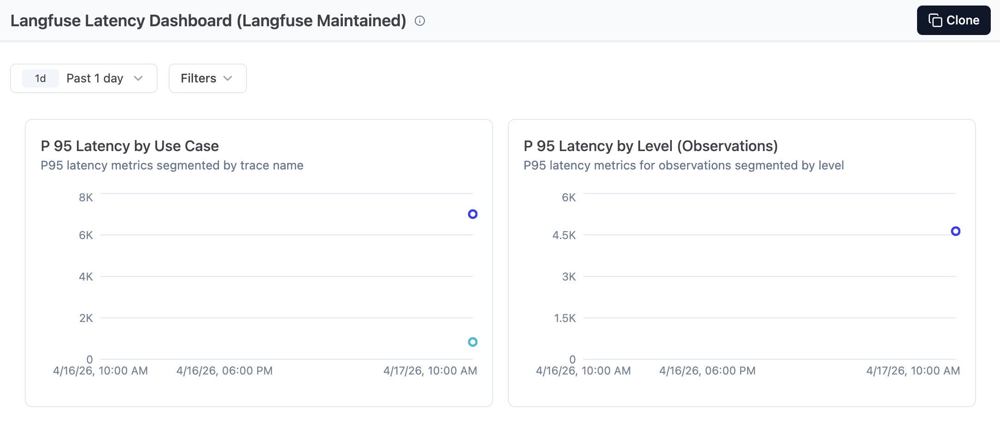
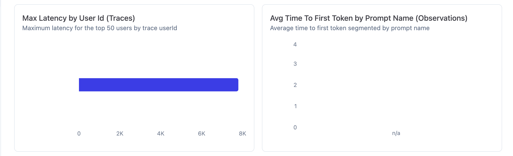
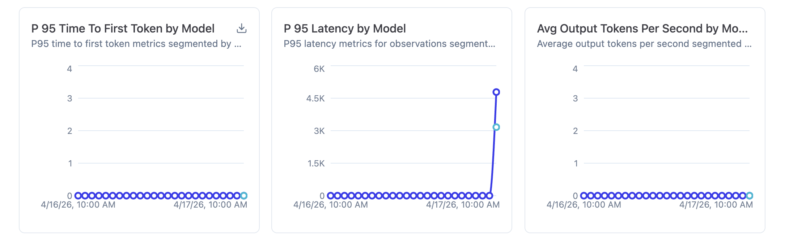

# Exercice M6E1 — Instrumenter l'agent avec Langfuse

## Etape 1 — Installation et configuration

```bash
pip install langfuse
```

Variables ajoutees dans `.env` :
```
LANGFUSE_SECRET_KEY=sk-lf-...
LANGFUSE_PUBLIC_KEY=pk-lf-...
LANGFUSE_HOST=https://cloud.langfuse.com
```

## Etape 2 — Instrumentation du code

### Architecture de tracage

```
fil-rouge/
├── tracing.py          # Module d'init Langfuse (no-op si cles absentes)
├── llm.py              # Client OpenAI instrumente via langfuse.openai
│   ├── @observe        appeler_llm()
│   └── @observe        appeler_llm_json()
└── main.py             # Boucle ReAct decoree
    ├── @observe        agent_react()        ← trace parent
    ├── @observe        choisir_outil()      ← span Reason
    ├── @observe        executer_outil()     ← span Act
    └── @observe        formuler_reponse()   ← span Observe
```

### Hierarchie des traces dans Langfuse

```
agent_react (trace)
 ├── choisir_outil (span)
 │    └── appeler_llm_json (span)
 │         └── appeler_llm (span)
 │              └── chat.completions.create (generation) ← auto-capture
 ├── executer_outil (span)
 │    └── [appel outil : search_web / query_db / search_articles / ...]
 └── formuler_reponse (span)
      └── appeler_llm (span)
           └── chat.completions.create (generation) ← auto-capture
```

### Points cles de l'implementation

1. **`tracing.py`** : module wrapper qui fournit des no-ops si Langfuse n'est pas installe ou configure — aucun impact sur le fonctionnement existant
2. **`langfuse.openai`** : drop-in replacement du client OpenAI qui trace automatiquement chaque appel API (modele, tokens in/out, latence, cout)
3. **`@observe()`** : decorateurs sur les fonctions ReAct pour creer la hierarchie parent/enfant

## Etape 3 — Generation de trafic

10 requetes variees executees via `generate_traffic.py` :

| # | Requete | Type | Outil |
|---|---------|------|-------|
| 1 | "Bonjour, qui es-tu ?" | Salutation | reponse_directe |
| 2 | "Quel est ton role ?" | Salutation | reponse_directe |
| 3 | "Combien de clients avons-nous ?" | Database | query_db |
| 4 | "Liste les clients Premium" | Database | query_db |
| 5 | "Quel est le ticket moyen par client ?" | Database | query_db (erreur → fallback) |
| 6 | "Briefing matinal : 3 actus IA" | Recherche | search_web |
| 7 | "Tendances cybersecurite 2026" | Recherche | search_web |
| 8 | "Quelles sont les dernieres nouveautes cloud ?" | Recherche | search_web |
| 9 | "Retrouve les articles archives sur Kubernetes" | RAG | search_articles |
| 10 | "Resume ce qu'on a dans nos archives sur le ML" | RAG | search_articles |

## Etape 4 — Analyse des traces

### Donnees globales Langfuse

- **11 traces** (10 agent_react + 1 test_trace)
- **95 observations** (spans + generations au sein des traces)
- **15 800 tokens** consommes (modele gpt-4o-mini-2024-07-18)
- **Cout total** : $0.003181
- **0 scores** (numeriques et categoriques)







### Dashboard Latence







Observations cles sur les graphiques :
- **P95 Latency by Use Case** : agent_react atteint ~7 000 ms (point bleu fonce), test_trace reste a ~0 ms (point bleu clair)
- **P95 Latency by Level (Observations)** : les spans atteignent ~4 500 ms en p95
- **P95 Latency by Model** : gpt-4o-mini passe de 0 a ~4 800 ms au moment du run de trafic (17/04 10h), avec un second point a ~3 000 ms
- **Max Latency by User Id** : un seul utilisateur avec une latence max ~8 000 ms
- **Avg Time To First Token** : n/a (non configure)

### Latences par span (percentiles)

| Observation | Type | p50 | p90 | p95 | p99 |
|---|---|---|---|---|---|
| agent_react | SPAN | 3.46s | 6.37s | 7.13s | 7.74s |
| formuler_reponse | SPAN | 1.83s | 3.68s | 4.67s | 5.47s |
| appeler_llm | SPAN | 1.37s | 2.85s | 3.18s | 5.17s |
| choisir_outil | SPAN | 1.36s | 2.13s | 2.49s | 2.78s |
| appeler_llm_json | SPAN | 1.36s | 2.13s | 2.49s | 2.78s |

### Latences trace globale

| Trace | p50 | p90 | p95 | p99 |
|---|---|---|---|---|
| agent_react | 3.28s | 6.21s | 7.00s | 7.64s |
| test_trace | 0.83s | 0.83s | 0.83s | 0.83s |

### Tableau des 3 appels les plus couteux

| # | Type d'appel | Latence (p95) | Tokens (15.8K total) | Cout estime ($) | Hypothese d'optimisation |
|---|---|---|---|---|---|
| 1 | `formuler_reponse` (search_web) | **4.67s** (p95) — le plus lent | ~40% des tokens (prompt de fidelite M5E6 + resultats JSON de l'outil) | ~$0.0013 | **Reduire le prompt** : les 7 regles de fidelite M5E6 sont envoyees a chaque appel. Les condenser en 3 regles cles reduirait le volume d'entree de ~200 tokens/appel |
| 2 | `choisir_outil` (SYSTEM_REACT) | **2.49s** (p95) | ~35% des tokens (system prompt SYSTEM_REACT avec exemples et regles d'arbitrage ~600 tokens) | ~$0.0011 | **Prompt caching** : le SYSTEM_REACT est identique a chaque requete. Utiliser le prefix caching d'OpenAI ou reduire les exemples few-shot |
| 3 | `agent_react` (requete 5, retry) | **7.00s** (p95 trace) | ~25% des tokens (4 appels LLM au lieu de 2 a cause du retry) | ~$0.0008 | **Validation amont** : un `SELECT name FROM sqlite_master` avant l'appel SQL eviterait le retry couteux en latence |

### Analyse : volume vs latence

- **Cout lie au VOLUME** : `formuler_reponse` est le span le plus lourd en tokens d'entree car il recoit le resultat complet de l'outil + les 7 regles de fidelite M5E6. Son p50 (1.83s) est 35% plus eleve que celui de `choisir_outil` (1.36s), confirmant que le volume de tokens impacte directement la latence.
- **Cout lie a la LATENCE** : les requetes avec retry (requete 5 "ticket moyen") font exploser le p95 de la trace a 7.00s car elles declenchent 4 appels LLM au lieu de 2. Le surcout n'est pas en tokens mais en temps d'attente cumule. Le graphique P95 Latency by Model confirme ce pic avec un point a ~4 800 ms.

### Optimisation prioritaire

L'optimisation la plus impactante serait de **reduire le system prompt de `formuler_reponse`**. Les 7 regles de fidelite M5E6 consomment ~200 tokens a chaque appel et sont identiques pour toutes les requetes — on pourrait les condenser en 3 regles essentielles ("ne rien inventer", "corriger les fausses premisses", "annoncer le nombre reel de resultats"). En second lieu, le `SYSTEM_REACT` dans `choisir_outil` pourrait beneficier d'un **prompt caching** (prefixe statique) pour reduire le cout des ~600 tokens repetes a chaque requete. Enfin, pour les requetes database, une **validation prealable des tables existantes** (`SELECT name FROM sqlite_master`) eviterait les iterations de retry qui doublent la latence totale sans apporter de valeur.

## Fichiers modifies

| Fichier | Modification |
|---------|-------------|
| `fil-rouge/tracing.py` | Nouveau — init Langfuse, decorateurs no-op |
| `fil-rouge/llm.py` | Client OpenAI instrumente + `@observe` sur appeler_llm/appeler_llm_json |
| `fil-rouge/main.py` | `@observe` sur les 4 fonctions ReAct + flush en fin de requete |
| `fil-rouge/requirements.txt` | Ajout `langfuse>=2.0.0` |
| `fil-rouge/.env.example` | Ajout des 3 variables Langfuse |
| `fil-rouge/generate_traffic.py` | Script de generation de 10 requetes variees |
